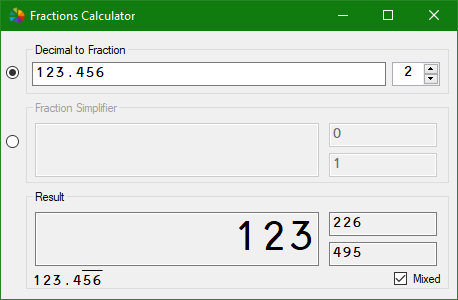
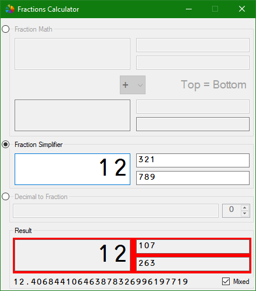
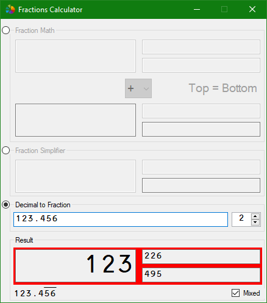

# Fractions Calculator

A simple tool for math with fractions and more.

## Features

* Add, subtract, multiply, and divide fractions.
* Compare fractions.
* Simplify fractions.
* Convert a repeating decimal number to a fraction.

## Screenshots

